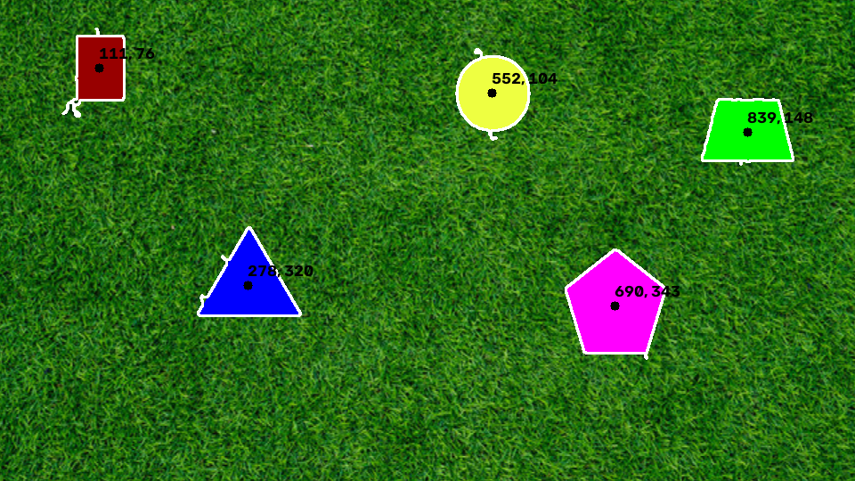

# Penn Aerial Robotics (PennAIR) Software Challenge

## Task Overview:

### Part 1: Shape Detection on Static Image

### Part 2: Shape Detection on Video

### Part 3: Background Agnostic Algorithm

### Part 4: Make it 3D
